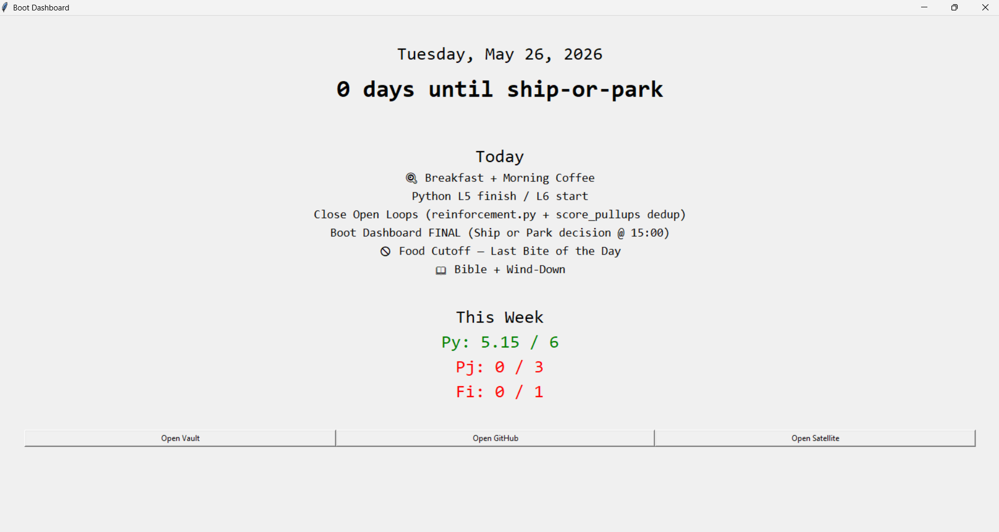

# Boot Dashboard

A Python desktop dashboard that auto-launches on Windows boot and punches you in the face with the work you said you'd do this week.



Built to solve two real problems: weekend project drift (Saturday opens, nothing structured, hours leak) and the need for a hands-on Python project during the first month of a 6-month learning push. Wires together Tkinter, the Google Calendar API, and the Windows Startup folder into a single screen I see before anything else every morning.

## Features

- **Auto-launches on Windows boot.** A shortcut in the Windows Startup folder runs the dashboard automatically after login — no manual start.
- **Header with ship-or-park countdown.** Today's date plus days remaining until the active goal deadline.
- **Today's calendar.** Pulls today's events from the primary Google Calendar on launch, listed in chronological order. Refreshes by closing + reopening.
- **Weekly hour tracker.** Three buckets — Python, Project, Financial — shown against weekly targets and color-coded red/green based on whether I'm on pace for the current day of the week.
- **Manual hour logging.** Hours are entered nightly into a local `hours.json` file. No time-tracking integration in v1.
- **Quick-launch buttons.** One-click access to my Obsidian vault, GitHub profile, and the Satellite Orbit Predictor repo.

## Tech stack

- **Python 3.12** — language and runtime.
- **Tkinter** — GUI framework. Standard library, no extra install required (intentional — minimal footprint).
- **google-api-python-client + google-auth-oauthlib** — Google Calendar API client and OAuth flow handler.
- **JSON** — data format for `hours.json` (weekly hour entries) and the OAuth token cache (`token.json`).
- **Windows Startup folder + `launch.bat`** — auto-launch mechanism. A shortcut in `shell:startup` runs a 4-line batch script that activates the venv and starts the dashboard.
- **`venv` + `requirements.txt`** — environment management, standard pip workflow.

## Setup

### 1. Clone, venv, and dependencies

```powershell
git clone https://github.com/FedorowiczDominik624/boot-dashboard.git
cd boot-dashboard
python -m venv venv
.\venv\Scripts\Activate.ps1
pip install -r requirements.txt
```

If PowerShell blocks the activation script with an execution policy error, run this once and try again:

```powershell
Set-ExecutionPolicy -Scope CurrentUser -ExecutionPolicy RemoteSigned
```

### 2. Google Calendar OAuth

The dashboard reads from your primary Google Calendar via the Google Calendar API. You need OAuth credentials to grant it read access.

1. Go to the [Google Cloud Console](https://console.cloud.google.com/).
2. Create a new project (or select an existing one).
3. Enable the **Google Calendar API** for the project (APIs & Services → Library → search "Google Calendar API" → Enable).
4. Configure the OAuth consent screen (APIs & Services → OAuth consent screen):
   - User type: **External**
   - Fill in the required fields (app name, support email)
   - Add your Google account as a **test user**
5. Create credentials (APIs & Services → Credentials → Create Credentials → OAuth client ID):
   - Application type: **Desktop app**
   - Download the resulting JSON file and rename it to `credentials.json`
6. Place `credentials.json` in the project root (same folder as `main.py`).

On first run the dashboard will open a browser window asking you to authorize access. After approval, a `token.json` file is created automatically — this caches your auth so you don't have to re-approve every launch.

> Both `credentials.json` and `token.json` are gitignored. Never commit them.

### 3. First run

With the venv activated:

```powershell
python main.py
```

On the very first run a browser tab opens for Google OAuth approval. Approve it, then the dashboard window appears with today's events, this week's hour progress, and the quick-launch buttons.

If the dashboard renders but the hours all show as `0`, that's expected — edit `hours.json` to set this week's targets and your current logged hours.

### 4. Auto-launch on Windows boot

To make the dashboard launch automatically every time you log in:

1. Press `Win + R`, type `shell:startup`, hit Enter. A File Explorer window opens to the Windows Startup folder.
2. In a second File Explorer window, navigate to the project folder. Right-click `launch.bat` → **Show more options** → **Create shortcut**.
3. Move the new `launch.bat - Shortcut` from the project folder into the Startup folder.
4. Restart your laptop. The dashboard should auto-launch within ~1 minute of login.

To disable auto-launch later, just delete the shortcut from the Startup folder. The original `launch.bat` in the project folder stays untouched.

## Known issues / roadmap

### Known issues (v1.0)

- **Console window flash on boot.** `launch.bat` uses `python` instead of `pythonw` because `pythonw` silently fails to render the dashboard. Cause unconfirmed — suspect `google-auth` writing to stderr during token refresh, or a `pythonw` stdout-detach quirk. Workaround: console flashes briefly on startup, then closes.
- **Plural bug in countdown header.** Displays `"1 days until ship-or-park"` instead of `"1 day"`. Singular/plural not handled.
- **Event titles only — no time formatting.** Calendar events render as bare summaries. Target format: `"HH:MM – HH:MM  Title"`.
- **All-day events.** Render as bare summary with no "all-day" prefix.
- **Calendar doesn't auto-refresh.** Close and reopen the dashboard to pull fresh events. No background polling in v1.

### Roadmap (v1.1+)

- Fix all v1.0 known issues above.
- **GitHub API integration** — days since last commit on a tracked repo.
- **Auto-detect hours from vault Weekly Update section** — kill the manual `hours.json` editing step.
- **Custom theming and improved Tkinter layout.**
- **Per-project status** pulled live from each project's `CLAUDE.md`.
- **Browser-based version (Flask)** for cross-device access.

## License

[MIT](LICENSE) © 2026 Dominik Fedorowicz
